# Groups Manager — Breadboard (Shape A)

## Places

| # | Place | Description |
|---|-------|-------------|
| P1 | Login | Name text input, sign-in flow |
| P2 | First-Time Setup | Title + org dropdowns for new users; back button returns to login or Employee Management |
| P3 | Profile Page | Any person's profile — name, email, title, org, group memberships; lands on your own after login |
| P4 | Search Results | Unified search across people and groups |
| P5 | Group Detail | Group info; Members tab (member list + inline add panel) and History tab; AM panel |
| P6 | AM Rule Editor Modal | Transactional rule builder — nothing commits until Save; Filters, Triggers, Preview, Save sections |
| P7 | Employee Management | Active and suspended employee list; create, update, suspend, rehire |
| P7.1 | Update Employee Modal | Edit a person's name, title, organization |
| P8 | About Page | Portfolio context — who built this and why |
| P9 | Backend (localStorage) | All persistent data stores |
| P10 | Create / Edit Group Modal | Shared form for creating a new group or editing an existing group's name, description, and membership setting |

**App Header (Global Component):** Persistent header in all post-login pages (P3, P4, P5, P7, P8). Contains home link, search input, and Settings dropdown. Not a Place — always accessible.

---

## Global App Header

Shared component rendered in P3, P4, P5, P7, and P8.

| # | Component | Affordance | Control | Wires Out | Returns To |
|---|-----------|------------|---------|-----------|------------|
| H1 | app-header | Logo / home link | click | → P3 (own profile) | — |
| H2 | app-header | Search input | submit | → P4 | — |
| H3 | app-header | Settings button | click | — (opens dropdown) | — |
| H4 | app-header | Manage Employees (dropdown item) | click | → P7 | — |
| H5 | app-header | Reset Demo (dropdown item) | click | → N39 | — |
| H6 | app-header | Logout (dropdown item) | click | → N44 | — |
| H7 | app-header | About (dropdown item) | click | → P8 | — |

---

## UI Affordances

| # | Place | Component | Affordance | Control | Wires Out | Returns To |
|---|-------|-----------|------------|---------|-----------|------------|
| U1 | P1 | login | Name text input (pre-filled "me") | type | — | — |
| U2 | P1 | login | Sign In button | click | → N1 | — |
| U3 | P1 | login | Welcome-back message "Welcome back, [Name]!" | render | → P3 | — |
| U4 | P1 | login | Suspended account message | render | — | — |
| U5 | P2 | setup | Back button | click | → previous place | — |
| U6 | P2 | setup | Title dropdown | select | → N7 | — |
| U7 | P2 | setup | Organization dropdown | select | → N7 | — |
| U8 | P2 | setup | Complete Setup button | click | → N8 | — |
| U9 | P3 | profile | Back button | click | → P4 | — |
| U10 | P3 | profile | Name | render | — | — |
| U11 | P3 | profile | Email | render | — | — |
| U12 | P3 | profile | Title | render | — | — |
| U13 | P3 | profile | Organization | render | — | — |
| U14 | P3 | profile | Group memberships list | render | — | — |
| U15 | P3 | profile | Group membership row (group name + role badge) | click | → P5 | — |
| U73 | P3 | profile | + Create a group (below group list) | click | → P10 | — |
| U16 | P4 | search | Search input (pre-filled with query) | type | → N12 | — |
| U17 | P4 | search | Results list | render | — | — |
| U18 | P4 | search | Person result row (name, title, org) | click | → P3 | — |
| U19 | P4 | search | Group result row (name, description) | click | → P5 | — |
| U20 | P4 | search | No results message | render | — | — |
| U21 | P5 | group-detail | Back button | click | → previous place | — |
| U22 | P5 | group-detail | Group name | render | — | — |
| U23 | P5 | group-detail | Group description | render | — | — |
| U24 | P5 | group-detail | Membership setting badge (ADMIN_ONLY \| OPEN) | render | — | — |
| U25 | P5 | group-detail | Change Setting toggle (admin only) | click | → N17 | — |
| U74 | P5 | group-detail | Edit Group button (admin only) | click | → P10 | — |
| U39 | P5 | group-detail | AM panel (rule summary or "Not configured") | render | — | — |
| U40 | P5 | group-detail | Edit Rules button (admin only) | click | → P6 | — |
| U26 | P5 | group-detail | Members tab | click | — (local tab state) | — |
| U27 | P5 | group-detail | History tab | click | — (local tab state) | — |
| U28 | P5 | group-detail | Member count | render | — | — |
| U29 | P5 | group-detail | Add Member button (conditional on setting + role) | click | — (opens inline panel) | — |
| U30 | P5 | group-detail | Inline search input | type | → N23 | — |
| U31 | P5 | group-detail | Inline search results (non-members only) | render | — | — |
| U32 | P5 | group-detail | Inline person row (name, title, org) | render | — | — |
| U33 | P5 | group-detail | Inline Add button (per person row) | click | → N24 | — |
| U34 | P5 | group-detail | Inline close button | click | — (closes inline panel) | — |
| U35 | P5 | group-detail | Member list | render | — | — |
| U36 | P5 | group-detail | Member row (name, role badge) | render | — | — |
| U37 | P5 | group-detail | Remove button (admin or self) | click | → N18 | — |
| U38 | P5 | group-detail | Promote / Demote button (admin only, last-admin guard) | click | → N19 | — |
| U41 | P5 | group-detail | History feed | render | — | — |
| U42 | P5 | group-detail | History event row ("[Person] [action] by [actor]") | render | — | — |
| U43 | P6 (Filters) | rule-editor | Conditions list | render | — | — |
| U44 | P6 (Filters) | rule-editor | Field selector (title / organization / email) per condition | select | → N27 | — |
| U45 | P6 (Filters) | rule-editor | Operator selector per condition | select | → N27 | — |
| U46 | P6 (Filters) | rule-editor | Value input (text or multi-select) per condition | change | → N27 | — |
| U47 | P6 (Filters) | rule-editor | Remove condition button (per row) | click | → N27 | — |
| U48 | P6 (Filters) | rule-editor | Add Condition button | click | → N27 | — |
| U49 | P6 (Filters) | rule-editor | AND / OR combinator (appears between conditions when 2+ exist) | click | → N27 | — |
| U52 | P6 (Preview) | rule-editor | Missing Members header + count — switches to "Adding (N) ✕" after Add Now clicked | render | — | — |
| U53 | P6 (Preview) | rule-editor | Preview row (name + values of filter fields referenced in conditions) | render | — | — |
| U54 | P6 (Preview) | rule-editor | Add Now button (next to Missing Members header) | click | → N28 | — |
| U80 | P6 (Preview) | rule-editor | ✕ button (appears after Add Now; clears staged adds, reverts to Missing Members) | click | → N48 | — |
| U81 | P6 (Preview) | rule-editor | Current Members header + count | render | — | — |
| U50 | P6 (Triggers) | rule-editor | On Create / Rehire checkbox (checked, disabled — always on) | render | — | — |
| U51 | P6 (Triggers) | rule-editor | On Update checkbox | click | → N27 | — |
| U55 | P6 (Save) | rule-editor | Save Rules button | click | → N30 | — |
| U56 | P6 (Save) | rule-editor | Cancel button (discards all draft changes incl. staged bulk adds) | click | → N31_cancel, → P5 | — |
| U57 | P7 | employee-mgmt | Active employees list | render | — | — |
| U58 | P7 | employee-mgmt | Active employee row (name, title, org) | render | — | — |
| U59 | P7 | employee-mgmt | Update button (per row, hidden for Zack) | click | → P7.1 | — |
| U60 | P7 | employee-mgmt | Suspend button (per row, hidden for Zack) | click | → N35 | — |
| U61 | P7 | employee-mgmt | Create Employee button | click | → P2 | — |
| U62 | P7 | employee-mgmt | Suspended employees section | render | — | — |
| U63 | P7 | employee-mgmt | Suspended employee row (name, title, org) | render | — | — |
| U64 | P7 | employee-mgmt | Rehire button (per suspended row) | click | → N37 | — |
| U65 | P7 | employee-mgmt | Back button | click | → P3 (own profile) | — |
| U66 | P7.1 | update-employee | Name input (pre-filled) | type | → N49 | — |
| U82 | P7.1 | update-employee | Email (read-only, auto-derives from name; updates live as name changes) | render | — | — |
| U67 | P7.1 | update-employee | Title dropdown (pre-filled) | select | — | — |
| U68 | P7.1 | update-employee | Organization dropdown (pre-filled) | select | — | — |
| U69 | P7.1 | update-employee | Update button | click | → N41 | — |
| U70 | P7.1 | update-employee | Cancel button | click | → P7 | — |
| U71 | P8 | about | About page content (app name, purpose, author, links) | render | — | — |
| U72 | P8 | about | Back button | click | → P3 (own profile) | — |
| U75 | P10 | create-edit-group | Name input (pre-filled if editing) | type | → N46 | — |
| U76 | P10 | create-edit-group | Description input (pre-filled if editing) | type | → N46 | — |
| U77 | P10 | create-edit-group | Who can add members — Admins only / Anyone (pre-selected if editing) | select | → N46 | — |
| U78 | P10 | create-edit-group | Create Group / Save Changes button | click | → N47 | — |
| U79 | P10 | create-edit-group | Cancel button | click | → previous place (P3 or P5) | — |

---

## Code Affordances

| # | Place | Component | Affordance | Control | Wires Out | Returns To |
|---|-------|-----------|------------|---------|-----------|------------|
| N1 | P1 | login | `lookupPerson(name)` | call | → N2 | — |
| N2 | P1 | login | name match decision | conditional | → U3 + S9 (if ACTIVE), → U4 (if SUSPENDED), → N3 + P2 (if unknown) | — |
| N3 | P1 | login | `generateEmail(name)` | call | — | → P2 |
| N4 | P2 | setup | `loadTitleOptions()` | call | — | → U6 |
| N5 | P2 | setup | `loadOrgOptions()` | call | — | → U7 |
| N6 | P2 | setup | `validateSetup(title, org)` | call | — | → U8 enabled/disabled |
| N7 | P2 | setup | setup state (title + org selected) | observe | — | → N6 |
| N8 | P2 | setup | `createEmployee(name, email, title, org)` | call | → S1, → N9, → N38, → S9 | — |
| N9 | P2 | setup | `writeChangeEvent(EMPLOYEE_CREATED)` | call | → S4 | → P3 |
| N10 | P3 | profile | `loadPerson(id)` | call | → S1 | → U10, U11, U12, U13 |
| N11 | P3 | profile | `loadPersonMemberships(id)` | call | → S3, S2 | → U14 |
| N12 | P4 | search | `performSearch(query)` | call | → S1, S2 | → N13 |
| N13 | P4 | search | `searchResults` store | write | — | → U17, U18, U19, U20 |
| N14 | P5 | group-detail | `loadGroup(id)` | call | → S2 | → U22, U23, U24, U28 |
| N15 | P5 | group-detail | `loadGroupMembers(id)` | call | → S3, S1 | → U35 |
| N16 | P5 | group-detail | `loadGroupHistory(id)` | call | → S4 | → U41 |
| N17 | P5 | group-detail | `changeGroupSetting(groupId, setting)` | call | → S2, → N20 | — |
| N18 | P5 | group-detail | `removeMember(groupId, personId)` | call | → S3, → N20 | — |
| N19 | P5 | group-detail | `changeMemberRole(groupId, personId, role)` | call | → S3, → N20, → last-admin guard | — |
| N20 | P5 | group-detail | `writeChangeEvent(event)` | call | → S4 | → U41 (reload) |
| N21 | P5 | group-detail | `loadGroupRules(groupId)` | call | → S5 | → U39 |
| N22 | P5 | group-detail | `checkAddMemberPermission(groupId, actorId)` | call | — | → U29 visible/hidden |
| N23 | P5 | group-detail | `searchNonMembers(groupId, query)` | call | → S1, S3 | → U31 |
| N24 | P5 | group-detail | `addMember(groupId, personId, addedBy)` | call | → S3, → N20 | → U35 reload |
| N25 | P6 | rule-editor | `loadExistingRules(groupId)` | call | → S5 | → U43, U49, U51 |
| N26 | P6 | rule-editor | `evaluateRules(conditions, combinator, groupId)` | call | → S1, S3, S11 | → U52, U53 |
| N27 | P6 | rule-editor | conditions change handler (field / op / value / AND-OR / triggerOnUpdate) | observe | → N26 | — |
| N28 | P6 | rule-editor | `bulkAdd(groupId, personIds)` | call | → S11 (draft only — not committed to S3) | → U52, U53 reload |
| N29 | P6 | rule-editor | `writeChangeEvents(events, actorType: AUTOMATIC_MEMBERSHIP)` | call | → S4 | — |
| N30 | P6 | rule-editor | `saveRules(groupId, rules)` | call | → S5, → S11→S3 (commit staged), → N29 | → P5 (close + reload) |
| N31 | P6 | rule-editor | `cancelModal()` — discards S11 draft entirely | call | → S11 (clear) | → P5 |
| N32 | P7 | employee-mgmt | `loadAllEmployees()` | call | → S1 | → U57, U62 |
| N33 | P7 | employee-mgmt | `checkSystemAdminGuard(personId)` | call | — | → U59, U60 hidden/shown |
| N34 | P7 | employee-mgmt | `loadTitleOptions()` / `loadOrgOptions()` for update modal | call | → S6, S7 | → U67, U68 |
| N35 | P7 | employee-mgmt | `suspendEmployee(id)` | call | → S1, → N36 | — |
| N36 | P7 | employee-mgmt | `removeFromAllGroups(personId)` | call | → S3, → N20 (per group) | → U57, U62 reload |
| N37 | P7 | employee-mgmt | `rehireEmployee(id)` | call | → S1, → N38, → N20 | — |
| N38 | P7 | employee-mgmt | `evaluateAutoMembershipOnCreate(personId)` | call | → S5, S1, S3 (per group with rules) | — |
| N39 | App | app | `resetDemo()` | call | → S8 (re-seed), → localStorage clear | → P1 |
| N50 | App | app | `initializeStorage()` — on app load, seeds localStorage from S8 if empty; no-op if data already present | call | → S8 | → P1 |
| N40 | P7.1 | update-employee | `loadEmployeeForUpdate(id)` | call | → S1 | → U66, U67, U68, U82 |
| N49 | P7.1 | update-employee | `deriveEmail(name)` — live email derivation on each name keystroke | call | — | → U82 |
| N41 | P7.1 | update-employee | `updateEmployee(id, name, title, org)` | call | → S1 (update + regenerate email), → N42, → N43 | — |
| N42 | P7.1 | update-employee | `writeChangeEvent(EMPLOYEE_UPDATED)` | call | → S4 | — |
| N43 | P7.1 | update-employee | `evaluateAutoMembershipOnUpdate(personId)` | call | → S5 (groups where triggerOnUpdate=true), → S3, → N29 | → P7 (close + reload) |
| N44 | App | app | `logout()` | call | → S9 (clear) | → P1 |
| N48 | P6 | rule-editor | `clearStagedAdds()` — clears S11, reverts Preview to Missing Members state | call | → S11 (clear) | → U52, U53 reload |
| N45 | P10 | create-edit-group | `loadGroupForEdit(groupId)` — reads S2; null groupId = create mode | call | → S2 | → U75, U76, U77 |
| N46 | P10 | create-edit-group | form state (name + desc + setting) | observe | — | → U78 enabled/disabled |
| N47 | P10 | create-edit-group | `saveGroup(name, desc, setting, groupId?)` — creates or updates group | call | → S2, → N20 | → P5 (new or existing) |

---

## Data Stores (P9: Backend — localStorage)

| # | Store | Description |
|---|-------|-------------|
| S1 | `people` | `{id, name, email, title, organization, status, isSystemAdmin}[]` |
| S2 | `groups` | `{id, name, description, membershipSetting}[]` |
| S3 | `memberships` | `{groupId, personId, role, addedAt, addedBy}[]` |
| S4 | `changeEvents` | `{id, groupId, actorType, actorId, eventType, payload, timestamp}[]` |
| S5 | `autoMembershipRules` | `{groupId, conditions: [{field, operator, value}][], combinator, triggerOnUpdate}[]` |
| S6 | `predefinedTitles` | Static list — 13 titles |
| S7 | `predefinedOrgs` | Static list — 8 organizations |
| S8 | `seedData` | 13 people (one per title, all 8 orgs covered), 6 groups (incl. All Employees), pre-seeded AM history |
| S9 | `currentSession` | `{personId}` — currently logged-in person |
| S10 | `searchResults` | Transient — `{type: 'person'|'group', ...}[]` — in-memory only |
| S11 | `modalDraft` | Transient — staged bulk-add memberships within an AM Rule Editor session; cleared on Save or Cancel |

---

## Navigation Map (Mermaid)

```mermaid
flowchart TB
    subgraph AppHeader["App Header (Global)"]
        H1["H1: Home link"]
        H2["H2: Search input"]
        H3["H3: Settings btn"]
        H4["H4: Manage Employees"]
        H5["H5: Reset Demo"]
        H6["H6: Logout"]
        H7["H7: About"]
    end

    subgraph P1["P1: Login"]
        U2["U2: Sign In"]
        U3["U3: Welcome-back msg"]
        U4["U4: Suspended msg"]
        N1["N1: lookupPerson()"]
        N2["N2: match decision"]
        N3["N3: generateEmail()"]
    end

    subgraph P2["P2: First-Time Setup"]
        U5["U5: Back"]
        U8["U8: Complete Setup"]
        N8["N8: createEmployee()"]
    end

    subgraph P3["P3: Profile Page"]
        U9["U9: Back"]
        U15["U15: Group row"]
    end

    subgraph P4["P4: Search Results"]
        U18["U18: Person row"]
        U19["U19: Group row"]
    end

    subgraph P5["P5: Group Detail"]
        U21["U21: Back"]
        U26["U26: Members tab"]
        U27["U27: History tab"]
        U29["U29: Add Member btn"]
        U34["U34: Close inline"]
        U38["U38: Promote/Demote"]
        U40["U40: Edit Rules btn"]
    end

    subgraph P6["P6: AM Rule Editor Modal"]
        U55["U55: Save Rules"]
        U56["U56: Cancel"]
    end

    subgraph P7["P7: Employee Management"]
        U59["U59: Update btn"]
        U61["U61: Create Employee"]
        U64["U64: Rehire btn"]
        U65["U65: Back"]
        _P71["_P7.1 Update Modal"]
    end

    subgraph P71["P7.1: Update Employee Modal"]
        U69["U69: Update"]
        U70["U70: Cancel"]
    end

    subgraph P8["P8: About Page"]
        U72["U72: Back"]
    end

    subgraph P10["P10: Create / Edit Group Modal"]
        U75["U75: Name input"]
        U76["U76: Description input"]
        U77["U77: Who can add members"]
        U78["U78: Create / Save Changes"]
        U79["U79: Cancel"]
        N45["N45: loadGroupForEdit()"]
        N46["N46: form state"]
        N47["N47: saveGroup()"]
    end

    %% Login flows
    U2 --> N1
    N1 --> N2
    N2 -->|ACTIVE| U3
    U3 --> P3
    N2 -->|SUSPENDED| U4
    N2 -->|unknown| N3
    N3 --> P2

    %% Setup flow
    U5 --> P1
    U8 --> N8
    N8 --> P3

    %% Header nav
    H1 --> P3
    H2 --> P4
    H3 --> H4
    H3 --> H5
    H3 --> H6
    H3 --> H7
    H4 --> P7
    N50["N50: initializeStorage()"] --> P1
    H5 --> N39["N39: resetDemo()"]
    N39 --> P1
    H6 --> N44["N44: logout()"]
    N44 --> P1
    H7 --> P8

    %% Profile nav
    U9 --> P4
    U15 --> P5

    %% Search nav
    U18 --> P3
    U19 --> P5

    %% Group Detail
    U21 --> P4
    U26 -->|Members tab| P5
    U27 -->|History tab| P5
    U29 -->|opens inline| P5
    U34 -->|closes inline| P5
    U40 --> P6
    U55 --> P5
    U56 --> P5

    %% Employee Management
    U59 --> P71
    U61 --> P2
    U64 -->|rehire| P7
    U65 --> P3
    U69 --> P7
    U70 --> P7

    %% About
    U72 --> P3

    %% Create / Edit Group
    U73 --> P10
    U74 --> P10
    N45 --> P10
    U78 --> N47
    N47 --> P5
    U79 --> P3

    %% Place references
    _P71 --> P71

    classDef ui fill:#ffb6c1,stroke:#d87093,color:#000
    classDef nonui fill:#d3d3d3,stroke:#808080,color:#000
    classDef header fill:#fff3cd,stroke:#ffc107,color:#000
    classDef placeRef fill:#ffb6c1,stroke:#d87093,stroke-width:2px,stroke-dasharray:5 5

    class U2,U3,U4,U5,U8,U9,U15,U18,U19,U21,U26,U27,U29,U34,U40,U55,U56,U59,U61,U64,U65,U69,U70,U72,U73,U74,U78,U79 ui
    class N1,N2,N3,N8,N39,N44,N47 nonui
    class H1,H2,H3,H4,H5,H6,H7 header
    class _P71 placeRef
```

---

## Key Wiring Notes

**`writeChangeEvent` (N20) is called from multiple places:**
N17 (changeGroupSetting), N18 (removeMember), N19 (changeMemberRole), N24 (addMember), N29 (AM bulk add — called from N30 on save), N36 (removeFromAllGroups on suspend), N9 (employee created), N42 (employee updated), N37 (rehire)

**AM Rule Editor is fully transactional — nothing persists until Save:**
- N28 (`bulkAdd`) writes staged memberships to S11 (modal draft) only — S3 is not touched
- N26 (`evaluateRules`) reads S11 to show staged adds reflected in the Preview
- N30 (`saveRules`) commits S5 (rules) + promotes S11 staged memberships to S3 + calls N29 (ChangeEvents)
- N31 (`cancelModal`) clears S11 entirely — staged adds are discarded; S3 unchanged
- N48 (`clearStagedAdds`) clears S11 without closing the modal — reverts Preview from "Adding (N) ✕" back to "Missing Members (N) [Add Now]"

**Preview section has two sub-sections:**
- **Missing Members** — people who match the rules but aren't group members yet; [Add Now] button next to header
- **Current Members** — people who match the rules and are already members
- After clicking Add Now, Missing Members re-labels to "Adding (N) ✕"; ✕ button (U80) triggers N48 to revert

**Combinator (U49) appears between condition rows only when 2+ conditions exist.**
When there is only one condition, no combinator is rendered.

**On Create / Rehire (U50) is always checked and disabled** — it is displayed for visibility but cannot be toggled.

**History events are person-first:** "[Person] added by [Actor]", "[Person] removed by [Actor]", etc.

**Inline Add Member is local state within P5, not a separate Place:**
U29 opens an inline panel; U34 closes it. No navigation occurs. N23 searches; N24 adds and reloads the member list.

**Auto-membership evaluation fires in four places:**
- N28/N30: Bulk Add staged in draft, committed on Save
- N8: on Create (P2) — evaluates all groups with rules
- N37: on Rehire (P7) — evaluates all groups with rules
- N43: on Update (P7.1) — only groups where triggerOnUpdate=true

**Last-admin guard:**
N19 (`changeMemberRole`) checks: if demoting, is this the last ADMIN? If yes, block. No ChangeEvent written.

**Suspend cascade:**
N35 (suspendEmployee) → N36 (removeFromAllGroups) → N20 per group. One ChangeEvent per group removed from, plus one EMPLOYEE_SUSPENDED ChangeEvent.

**Email uniqueness check:**
N8 (createEmployee) and N41 (updateEmployee) validate name + email uniqueness against S1 before writing.

**Cold-start seeding vs Reset:**
N50 (`initializeStorage()`) runs once on app load — seeds localStorage from S8 only if empty; no-op on return visits. N39 (`resetDemo()`) always clears and re-seeds regardless. Both result in navigating to P1.
